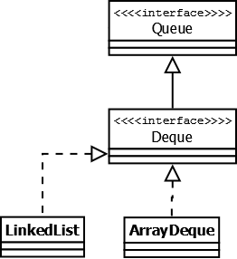

# Java Collection Framework
Это  иерархия интерфейсов и их реализаций, которые описывают устройство коллекций.

# Интерфейс Collection
Последовательные наборы элементов.

Этот интерфейс определяет основные методы работы с простыми наборами элементов, которые будут общими для всех его реализаций.

## Интерфейс List
Реализации этого интерфейса представляют собой упорядоченные коллекции.
Предоставляется доступ к элементам коллекции по индексу и по значению

### Vector
Реализация динамического массива объектов.
Позволяет хранить любые данные, включая null в качестве элемента.
Не рекомендуется к использованию, если не требуется достижения потокобезопасности.

### Stack
Данная коллекция является расширением коллекции Vector. Была добавлена как реализация стека LIFO (last-in-first-out). Является частично синхронизированной коллекцией (кроме метода добавления push()).

### ArrayList
Является реализацией динамического массива объектов. Позволяет хранить любые данные, включая null в качестве элемента. Его реализация основана на обычном массиве. Но данную коллекцию рекомендуется избегать, если требуется частое удаление/добавление элементов в середину коллекции.

### LinkedList
Позволяет хранить любые данные, включая null. Особенностью реализации данной коллекции является то, что в её основе лежит двунаправленный связный список (каждый элемент имеет ссылку на предыдущий и следующий). Благодаря этому, добавление и удаление из середины, доступ по индексу, значению происходит за линейное время O(n), а из начала и конца за константное O(1). Так же, ввиду реализации, данную коллекцию можно использовать как стек или очередь. Для этого в ней реализованы соответствующие методы.

## Интерфейс Set

Представляет собой неупорядоченную коллекцию, которая не может содержать дублирующиеся данные. Является программной моделью математического понятия «множество».

### HashSet
Реализация интерфейса Set, базирующаяся на HashMap. Внутри использует объект HashMap для хранения данных. В качестве ключа используется добавляемый элемент, а в качестве значения — объект-пустышка (new Object()). Из-за особенностей реализации порядок элементов не гарантируется при добавлении.

### LinkedHashSet
Отличается от HashSet только тем, что в основе лежит LinkedHashMap вместо HashMap. Благодаря этому отличию порядок элементов при обходе коллекции является идентичным порядку добавления элементов.

### TreeSet
Аналогично другим классам-реализациям интерфейса Set содержит в себе объект NavigableMap, что и обуславливает его поведение. Предоставляет возможность управлять порядком элементов в коллекции при помощи объекта Comparator

## Интерфейс Queue

Этот интерфейс описывает коллекции с предопределённым способом вставки и извлечения элементов, а именно — очереди FIFO (first-in-first-out). Помимо методов, определённых в интерфейсе Collection, определяет дополнительные методы для извлечения и добавления элементов в очередь. 

### PriorityQueue
Является единственной прямой реализацией интерфейса Queue

Особенностью данной очереди является возможность управления порядком элементов.

### ArrayDeque
Реализация интерфейса Deque, который расширяет интерфейс Queue методами, позволяющими реализовать конструкцию вида LIFO (last-in-first-out).

# Интерфейс Map

Наборы пар <ключ - значение> (Словари)

Данный интерфейс предоставляет базовые методы для работы с данными вида «ключ — значение».
### Hashtable 
Реализация такой структуры данных, как хэш-таблица. Она не позволяет использовать null в качестве значения или ключа. Не является упорядоченной.

Hashtable является синхронизированной. Из-за этой особенности у неё имеются существенные проблемы с производительностью.

### HashMap
HashMap не синхронизирована и HashMap позволяет использовать null как в качестве ключа, так и значения. Не является упорядоченной: порядок хранения элементов зависит от хэш-функции.

### LinkedHashMap
Порядок итерирования равен порядку добавления элементов.

### TreeMap
Реализация Map основанная на красно-чёрных деревьях. Является упорядоченной.

### WeakHashMap
Реализация хэш-таблицы, где Garbage Collector автоматически удалит элемент из коллекции при следующей сборке мусора, если на ключ этого элемента нет жёстких ссылок.

# Сравнение временных характеристик основных коллекций

