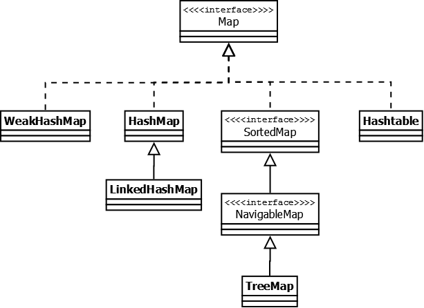

# Java Collection Framework
Это  иерархия интерфейсов и их реализаций, которая является частью JDK.

# Collection
Последовательные наборы элементов.

Этот интерфейс определяет основные методы работы с простыми наборами элементов, которые будут общими для всех его реализаций.

## List
Реализации этого интерфейса представляют собой упорядоченные коллекции.
Предоставляется доступ к элементам коллекции по индексу и по значению

# Map

Наборы пар <ключ - значение> (Словари)

Данный интерфейс предоставляет базовые методы для работы с данными вида «ключ — значение».
## Hashtable 
Реализация такой структуры данных, как хэш-таблица. Она не позволяет использовать null в качестве значения или ключа. Не является упорядоченной.

Hashtable является синхронизированной. Из-за этой особенности у неё имеются существенные проблемы с производительностью.

## HashMap
HashMap не синхронизирована и HashMap позволяет использовать null как в качестве ключа, так и значения. Не является упорядоченной: порядок хранения элементов зависит от хэш-функции.

## LinkedHashMap
Порядок итерирования равен порядку добавления элементов.

## TreeMap
Реализация Map основанная на красно-чёрных деревьях. Является упорядоченной.

## WeakHashMap
